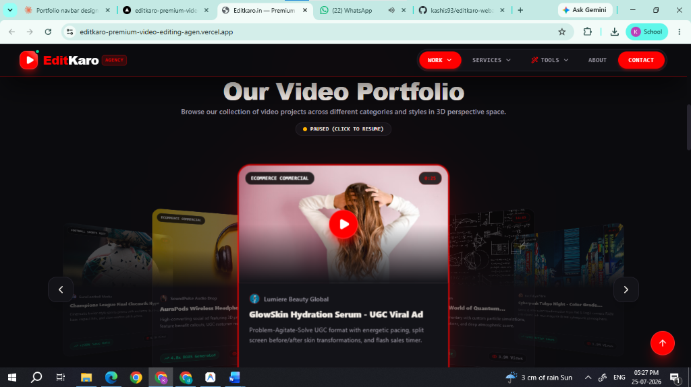

# 🎬 EditKaro — Premium Video Editing Agency Portfolio & Workstation



> **Live Demo**: [https://editkaro-premium-video-editing-agen.vercel.app](https://editkaro-premium-video-editing-agen.vercel.app)

---

## 📌 Overview

**EditKaro** is a high-performance web application designed for a video editing agency. Built with **React 19, Vite, and Tailwind CSS v4**, it goes beyond a traditional static portfolio by functioning as an **interactive client workstation**.

The application features 3D cinema carousel showcases, split-screen color grading visualizers, an AI-powered viral hook & script generator, an interactive pricing calculator, platform format comparison tools, exit-intent lead capture, and a seamless project booking workflow.

---

## 🌟 Key Features

- **🎬 3D Cinema Deck Showcase**: Interactive 3D Cover Flow layout displaying portfolio projects categorized into 9 editing styles with dynamic depth scaling and perspective transformations.
- **📱 Interactive Mobile Reel Simulator**: Smartphone interface (TikTok / Instagram Reels / YouTube Shorts) to preview vertical video content with interactive play/pause, caption overlays, and direct booking triggers.
- **🎚️ Color Grade Before/After Slider**: Split-screen handle allowing clients to compare raw LOG camera footage against fully color-graded LUT/HDR footage in real-time.
- **🤖 AI Viral Hook & Script Generator**: Powered by Google Gemini AI to analyze video niches/topics and generate viral opening hooks, retention tactics, and script outlines.
- **💰 Real-Time Retainer & Pricing Calculator**: Interactive calculator allowing prospective clients to estimate video production costs with instant quote calculations and confetti celebrations.
- **📐 Platform Comparison Studio**: Technical specifications and retention best practices compared side-by-side for YouTube, Instagram Reels, TikTok, LinkedIn, and Facebook.
- **🎯 Smart Lead Capture & Exit-Intent System**: Context-aware consultation form that auto-prefills user selections and catches exit intent with free strategy offers.

---

## 📂 9 Portfolio Categories

1. ⚡ **Short-Form Reels / Shorts**: Fast kinetic captions, velocity ramps, and pattern interrupts.
2. 🎬 **YouTube Long-Form**: Vox-style documentary essays, multi-cam sync, and storytelling pacing.
3. 🎮 **Gaming Edits**: Esports montages, 240fps beat sync, 3D camera tracking, and neon shaders.
4. ⚽ **Football / Sports Edits**: Rotoscoped player isolations, speed ramping, and crowd SFX.
5. 🛍️ **eCommerce Ads**: 3D explode views, UGC reaction cuts, problem-agitate-solve structure.
6. 🔬 **Documentary Style**: 2.5D parallax photo rotoscoping and deep atmospheric soundscapes.
7. 🎨 **Color Grading**: S-Log3 RAW transformations into vibrant cyberpunk teal & orange.
8. ⚔️ **Anime AMV Edits**: Frame-perfect beat sync, Twixtor 60fps interpolation, and optical flares.
9. 🚀 **Commercial TVCs**: Broadcast 5.1 surround sound audio, drone shots, and luxury film LUTs.

---

## 🛠️ Tech Stack

| Category | Technology |
| :--- | :--- |
| **Framework** | [React 19](https://react.dev/) |
| **Build Tool** | [Vite 6](https://vitejs.dev/) |
| **Styling** | [Tailwind CSS v4](https://tailwindcss.com/) |
| **Animations & 3D** | [Motion](https://motion.dev/) (Framer Motion v12) |
| **Icons & UI FX** | [Lucide React](https://lucide.react.dev/) & [Canvas Confetti](https://www.npmjs.com/package/canvas-confetti) |
| **AI Integration** | [Google Gemini AI API](https://ai.google.dev/) |
| **Deployment** | [Vercel](https://vercel.com/) |

---

## 🚀 Getting Started Locally

### Prerequisites
- Node.js (v18 or higher)
- npm or yarn

### Installation
1. Clone the repository:
   ```bash
   git clone https://github.com/kashis93/editkaro-webapp.git
   cd editkaro-webapp
   ```

2. Install dependencies:
   ```bash
   npm install
   ```

3. Configure Environment Variables:
   Create a `.env.local` file in the root directory and add your Gemini API Key:
   ```env
   GEMINI_API_KEY=your_gemini_api_key_here
   ```

4. Run the development server:
   ```bash
   npm run dev
   ```

5. Open your browser at `http://localhost:5173`.

---

## 📄 Deployment

Deploy directly to Vercel:
```bash
npm run build
```
Or connect your GitHub repository directly to [Vercel](https://vercel.com).

---

Developed with ❤️ for **Editkaro.in**
